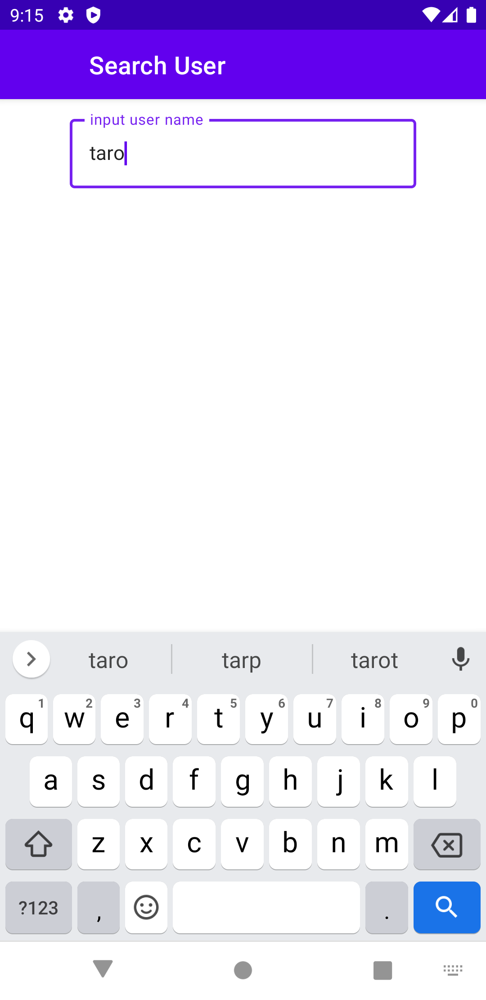

# Search GitHub user App (Android)
## Prerequisites
This app uses GitHub APIs with Basic Authentication.  
Please set credentials in [gradle.properties](/app/gradle.properties).  
(If credentials are not set, app uses GitHub APIs without authentication.  
 In this case, it may not work properly due to rate limit of GitHub APIs)

## Usage
### Search User
1. input username you want to search.
1. search results is shown at the bottom.
1. tap the user you want to confirm detail.(transit to User's Information screen)

  

### Show User's Information
1. user's information screen is shown.
(name, fullname, number of follwers, number of followings and repository list)
1. transit to the GitHub web page when repository in the list is tapped.

 
